# Color

Our products adapt intelligently and flexibly to cater to people's preferences. We are also committed to complying with AA standard contrast ratios. To do this, choose primary, secondary, and extended colors that support usability by ensuring sufficient color contrast between elements so that people with low vision can see and use the interface.

## Swatches

Color brings a design to life. Color is versatile; it's used to express emotion and tone, as well as place emphasis and create associations. Color should always be used in meaningful and intentional ways in order to create patterns and visual cues. 


These color collections are foundation for every palettes in the design system


### Brands

Only use for main background and emphasis text

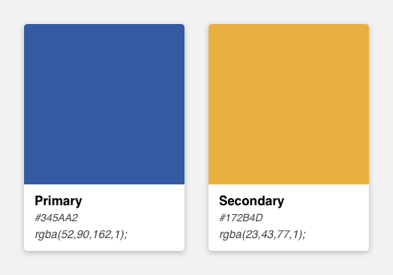

### Neutrals

Neutrals have varying degrees of saturation that allow for the appropriate level of warmth across marketing and product. Typically they are used for text and subtle backgrounds when we don't want to draw too much attention to a particular touchpoint or convey information such as "to do" or "disabled".

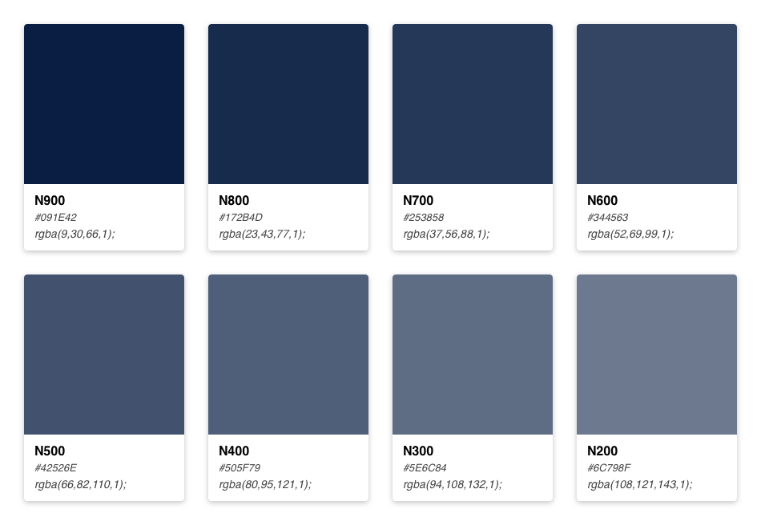

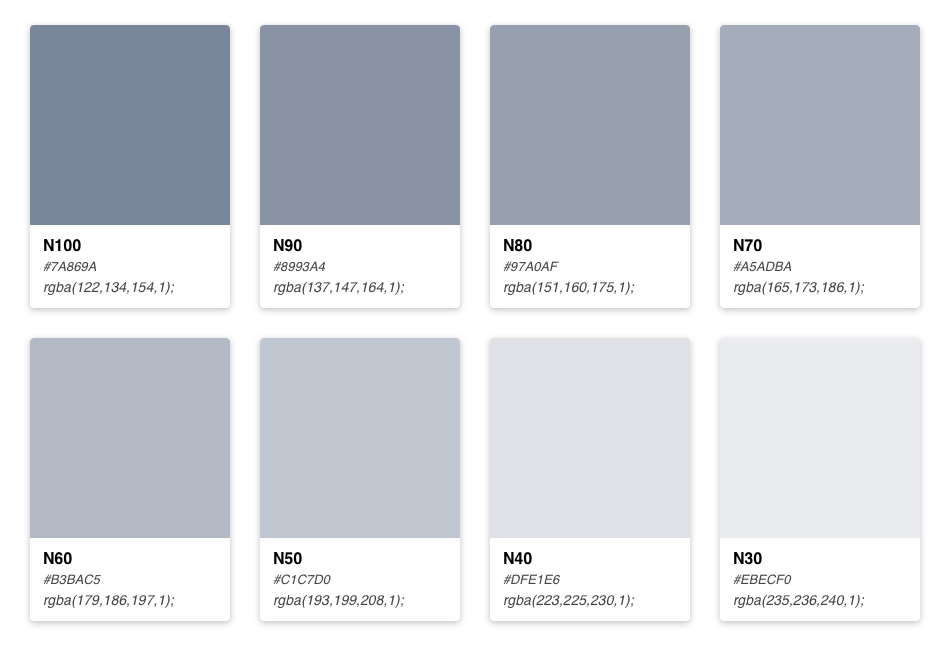

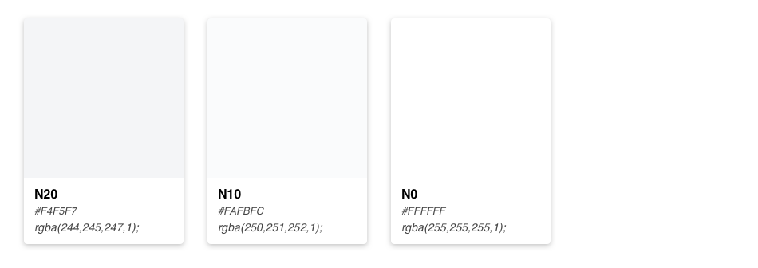

### Stencils

Based on N900, we created a list of transparent colors that will be used as background color in light mode

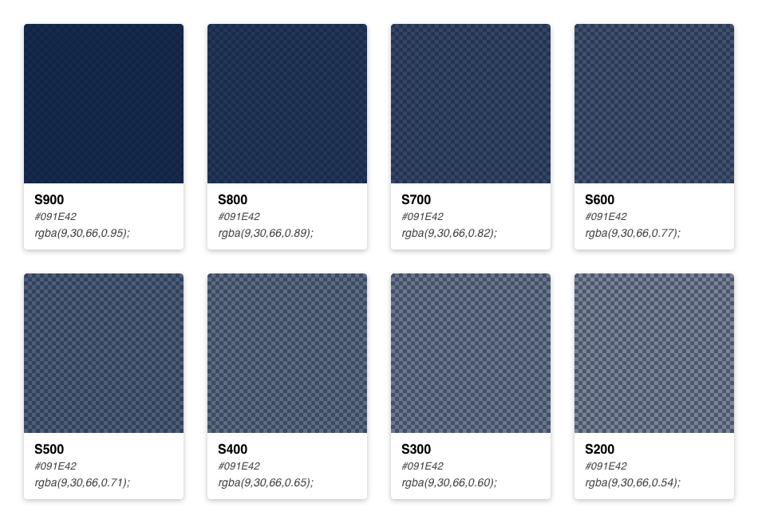

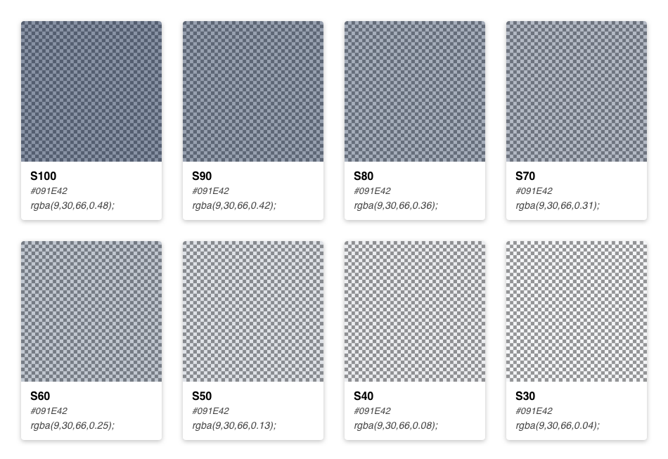

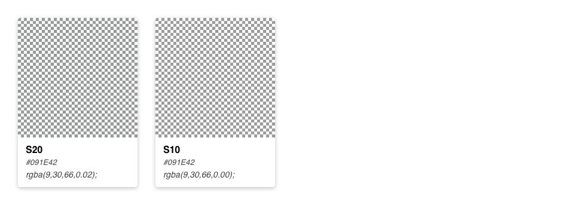

### Reds

Red is mainly used for backgrounds in messages and in error states to draw attention to important information or actions that are destructive or block workflow. You'll find red used in components such as lozenges, banner, flag messages, or buttons.

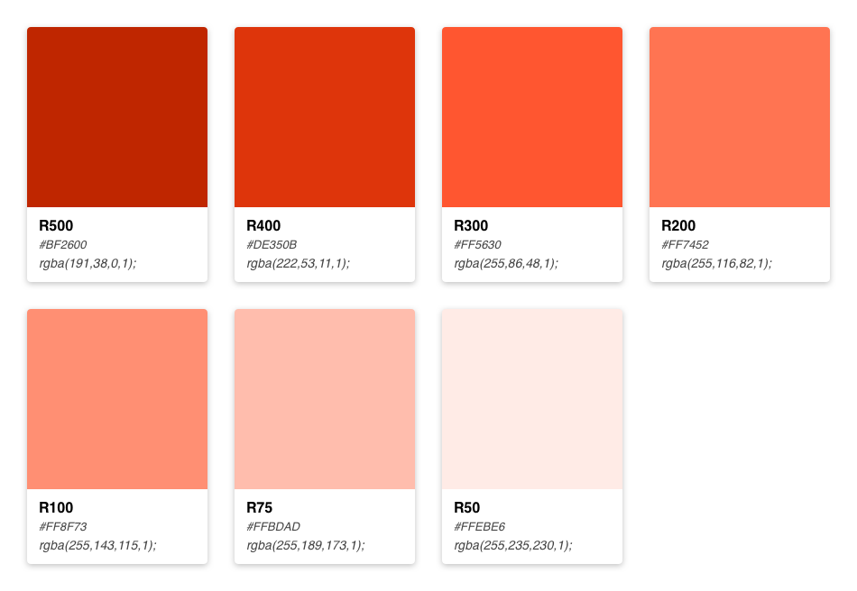

### Yellows

Yellow indicates a warning or that progress is impeded. Yellow feels right at home in components like lozenges, banners, flag messages, and buttons.

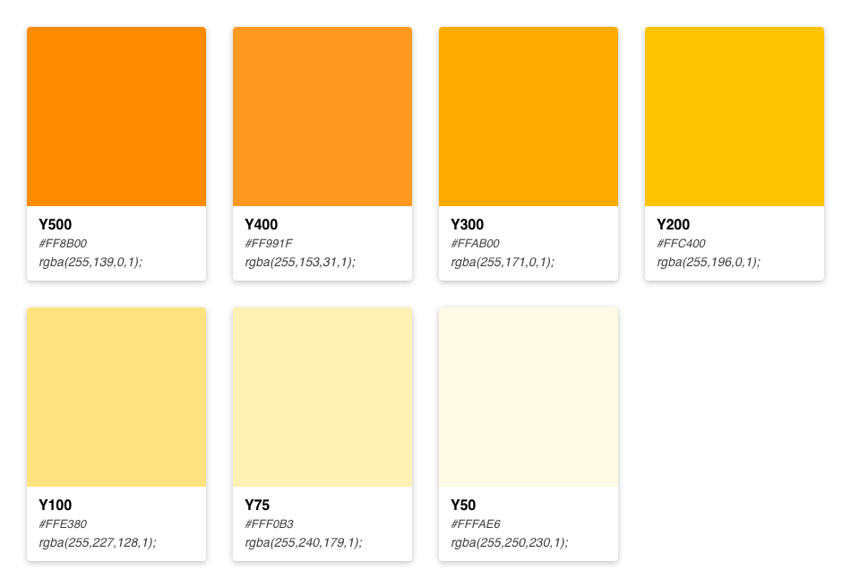

### Greens

We use green to indicate success or to celebrate a win. Green goes good with lozenges, badges, toggles, and messages.

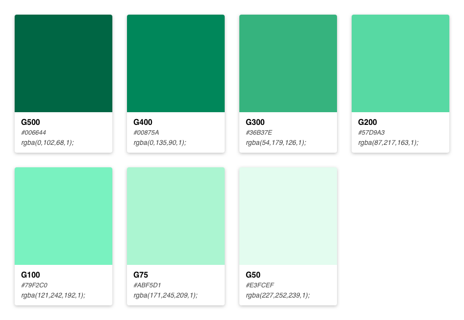

### Teals

A color made popular in the 1990's, teal can typically be found in product illustrations or as an accent color for components such a tags.

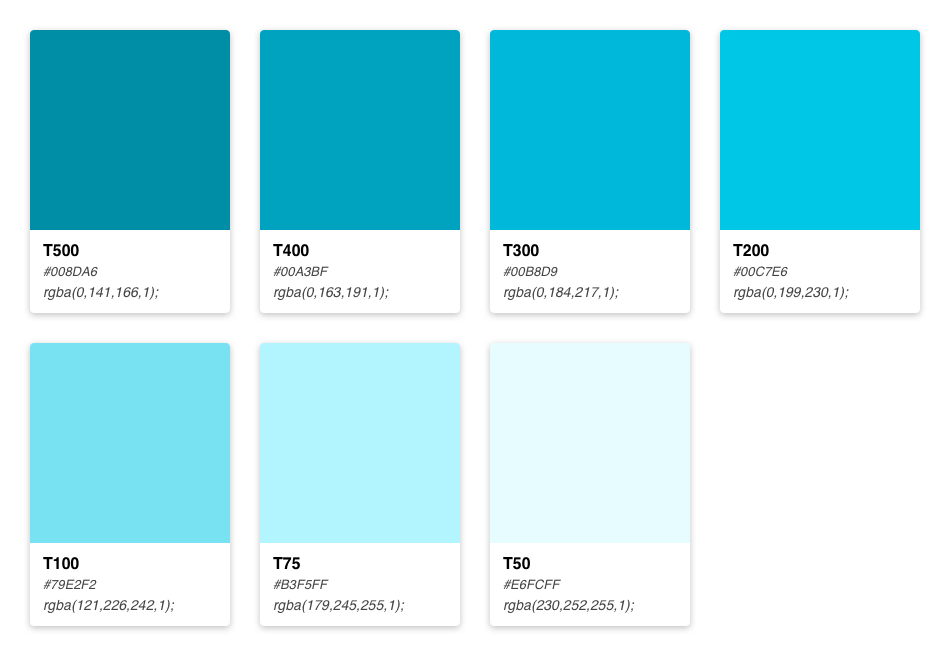

### Blues

Blue is used to indicate authentication, connectivity, or progress. You'll find blue in messages, buttons, navigation, lozenges, badges, tabs, and the progress tracker.

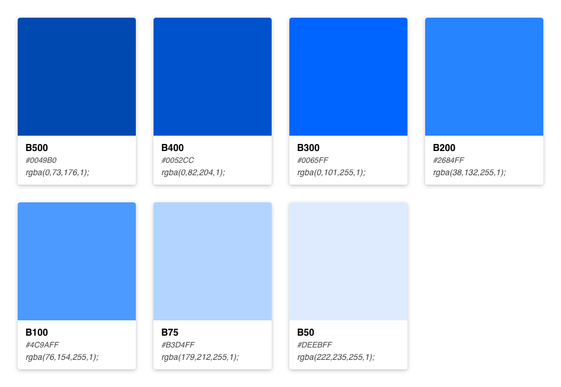

### Purples

Purple indicates help and support, and is used in spotlight, buttons, messages, lozenges, and image callouts.

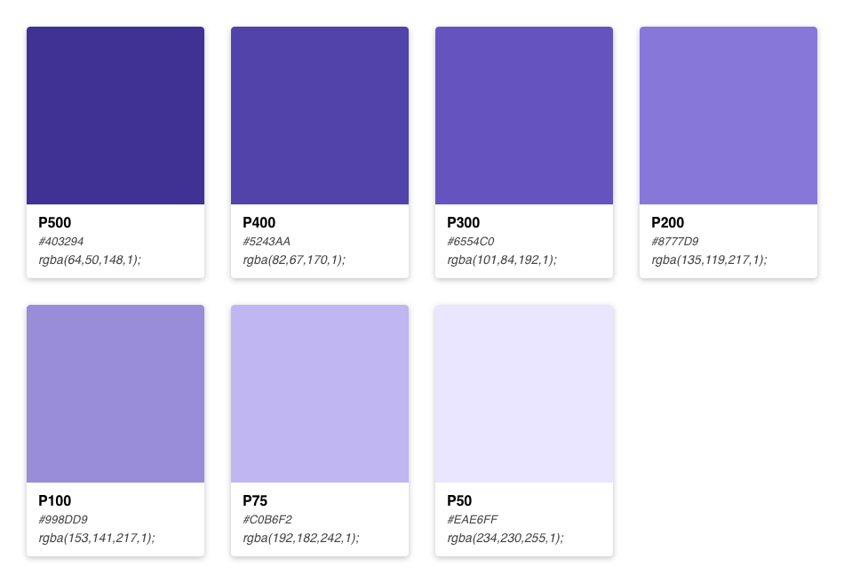

## Usage

The universal color variables are determined by common roles and usage; it is not based singularly on a color value \(i.e. unique hex code\). The same color value may be assigned to multiple variables in a theme's palette when the values have distinctly different roles.

A universal variable can also have multiple associated roles when the color is consistently used across those roles. This allows for uniform color application across themes while giving each theme the freedom to express its own individuality at a more detailed level.

### Color terms

| **Term** | **Definition** |  |
| --- | --- | --- | --- | --- | --- |
| **Value** | A unique color \(hex code\) assigned to a universal variable |  |
| **Role** | The systematic usage/s of a color value |  |
| **Variable** | The code identifier for a unique role or set of roles. Variables are universal and never change across themes. Within a theme variables are assigned appropriate values |  |
| **Themes** | The set of unique color values assigned to the universal palette |  |
| **Palette** | The complete set of universal variables. The palette is the naming conventions of colors used in the UI. Each theme will use the same palette of variables. |  |

### Color roles

| **Variable** | **Role\(s\)** | **Value** |
| --- | --- | --- | --- | --- | --- | --- | --- | --- | --- | --- | --- | --- | --- | --- | --- | --- | --- |
| **$brand-01** | Primary brand  Interactive text  Primary icon color  Emphasis background | `#345AA2` |
| **$brand-02** | Supporting brand | `#E9B040` |
| **$ui-01** | Primary background  Layer 1 background | `#FFFFFF` |
| **$ui-02** | Secondary background  Layer 0 background  Primary border | `#F4F5F7` |
| **$ui-03** | Secondary border | `rgba(#091E42, 0.13)` |
| **$ui-04** | Secondary icon color | `#5E6C84` |
| **$text-01** | Primary text  Body copy | `#172B4D` |
| **$text-02** | Secondary text  Subtle text  Help text | `#5E6C84` |
| **$text-03** | Placeholder text | `#B3BAC5` |
| **$support-danger** | Danger | `#FF5630` |
| **$support-success** | Success | `#36B37E` |
| **$support-warning** | Warning | `#FFAB00` |
| **$support-info** | Information | `#4C9AFF` |
| **$support-help** | Help | `#6554C0` |
| **$support-link** | Link | `#0052CC` |
| **$hover-row** | Row hover | `#EBECF0` |
|  |  |  |

