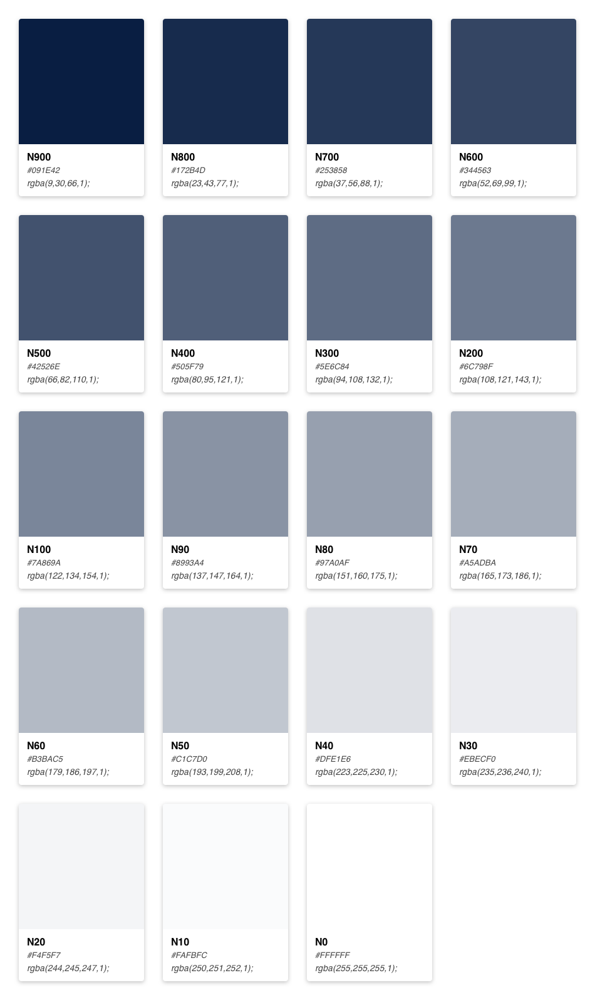

# Color

Our products adapt intelligently and flexibly to cater to people's preferences. We are also committed to complying with AA standard contrast ratios. To do this, choose primary, secondary, and extended colors that support usability by ensuring sufficient color contrast between elements so that people with low vision can see and use the interface.

## Swatches

Color brings a design to life. Color is versatile; it's used to express emotion and tone, as well as place emphasis and create associations. Color should always be used in meaningful and intentional ways in order to create patterns and visual cues. 


These color collections are foundation for every palletes in the design system


### Brands

Only use for main background and emphasis text

### Neutrals

Neutrals have varying degrees of saturation that allow for the appropriate level of warmth across marketing and product. Typically they are used for text and subtle backgrounds when we don't want to draw too much attention to a particular touchpoint or convey information such as "to do" or "disabled".

