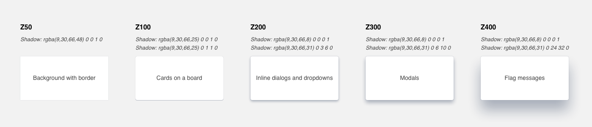

# Layers

## Layer types

Layer is the surface on which content and components live. It is a visual motif used to create groupings and associations between content as well as hierarchy and focus through depth

| **Layer name** | **Elevation** | **Box-shadow** | **Use for** |
| --- | --- | --- | --- | --- | --- |
| **Z50** | 0 | `0 0 1px 0 rgba(9,30,66,0.48);` | Background with border |
| **Z100** | 1 | `0 0 0 1px rgba(9,30,66,0.08) 0 1px 1px 0 rgba(9,30,66,0.31);` | Cards on a board |
| **Z200** | 6 | `0 0 0 1px rgba(9,30,66,0.08) 0 3px 6px 0 rgba(9,30,66,0.31);` | Inline dialogs & dropdowns |
| **Z300** | 10 | `0 0 0 1px rgba(9,30,66,0.08) 0 6px 10px 0 rgba(9,30,66,0.31);` | Modals |
| **Z400** | 32 | `0 0 0 1px rgba(9,30,66,0.08) 0 24px 32px 0 rgba(9,30,66,0.31);` | Flag messages |

## Properties

### Physical properties

* All layers are the same thickness.
* The implied thickness of one layer is one pixel.
* Layers live on distinct z coordinate planes and uses the offset of the y axis and blur of the box-shadow to represent this depth.
* Items with the same layer cannot occupy the same space.
* Components with different layers can be stacked one top of one another \(i.e. an overlay layer may exist on top of a raised layer\).
* The only defined style of a layer is its elevation and shadow. The layer container can be styled as needed.

### Content on layer

* Content appears on same plane as layer, content does not add to a layer's elevation.
* Content on a layer is bound by the edges of the layer container. Content cannot cross boundaries of the layer.
* Borders are the only overarching limitation of the content on layer, however limitations on the content per component may occur. See individual components for more details.

## Elevation

Each type of layer lives on a different imagined plane of the UI giving each its own distinct elevation. Elevation is the implied measured distance above the base layer. The affect of the elevation on a layer is defined by the intensity and depth of the shadow it casts.

### Elevation scale

The range of imagined planes in the UI are on a scale from 0 to 32, with zero being the base and 32 the highest point. The higher the elevation is the larger the shadow each layer will cast. Each unit on the elevation scale is equal to the pixel value of the coded blur applied to shadow.

Each layer is a defined marker along the elevation scale. There is not a layer for each level of the scale.

