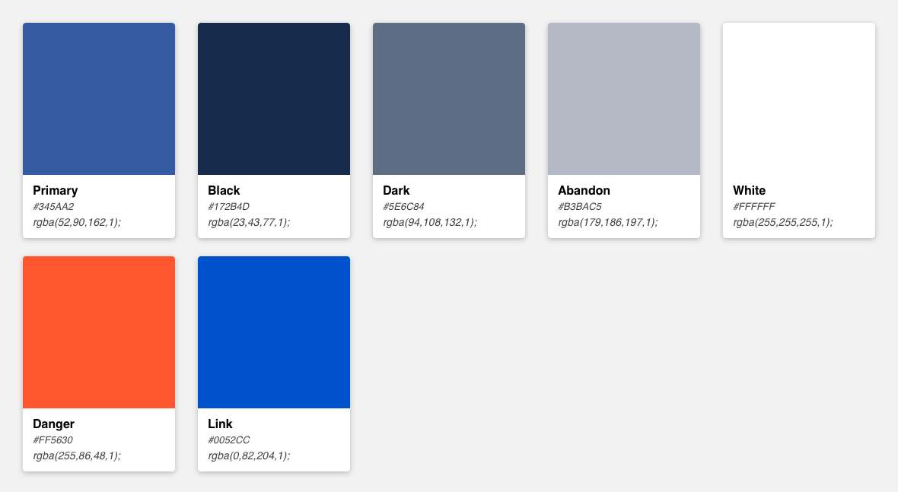

# Typography

## Font stacks

We use system-ui fonts to make sure that our user will have the best experience 'cause with this font stack the browser won't need to download fonts from other source, providing faster page load and better display compatible as a system fonts. 


We use sans-serif fonts for most of our type, the exception being when you want to display code then you should defer to monospace fonts.


### San-serif

```css
font-family: -apple-system, BlinkMacSystemFont, 'Segoe UI', 'Roboto', 'Oxygen', 'Ubuntu', 'Fira Sans', 'Droid Sans', 'Helvetica Neue', sans-serif;
```

### Monospaced

```css
font-family: "SF Mono", "Segoe UI Mono", "Roboto Mono", "Ubuntu Mono", Menlo, Courier, monospace;
```

## Type scale


We use rem unit as base unit for web development with **1 rem = 16 px**


| **Name** | **Typescale** | **rem** | **px** | **Role\(s\)** |
| --- | --- | --- | --- | --- | --- | --- | --- | --- | --- | --- | --- | --- | --- | --- |
| **P100** | legal | 0.625 | 10 | Especially small description |
| **P200** | caption | 0.75 | 12 | Short description field |
| **P300** | desc | 0.875 | 14 | label and short description |
| **P400** | base | 1 | 16 | Everything from regular paragraph to long description |
| **P500** | extend | 1.25 | 20 | For exceptional situation only |
| **H100** | omega | 0.625 | 10 | Lowest level headings |
| **H200** | zeta | 0.75 | 12 | Low level headings. Heading up a group of list items |
| **H300** | epsilon | 0.875 | 14 | Deep headings and for highlighting important pieces of information |
| **H400** | delta | 1 | 16 | Sub-section and field group headings |
| **H500** | gamma | 1.25 | 20 | Headings that identify key functionality |
| **H600** | beta | 1.5 | 24 | Main titles, use only once per page |
| **H700** | alpha | 1.75 | 28 | Empty states and feature introductions. Top level headers |
| **H800** | mega | 2.125 | 34 | For oversized screen titles. Use in moderation |
| **H900** | giga | 2.5 | 40 | Extraordinary title |

## Typographic treatments

### Font weight

Font weight is an important typographic style that can add emphasis and is used to differentiate content hierarchy. Font weight and size pairings must be carefully balanced. A bold weight will always have more emphasis than a lighter weight font of the same size. However, a lighter weight font can rank hierarchically higher than a bold font if the lighter weight type size is significantly larger than the bold.

| **Font-weight: 400 / Regular**  _Should only be used at sizes smaller than or equal to 14px / 0.875rem in paragraph_ |
| --- | --- | --- |
| **Font-weight: 500 / Semi-bold** _Should only be used at sizes from 10px / 0.625rem to 20px / 1.25rem in heading_ |
| **Font-weight: 600 / Medium** _Should only be used at sizes greater than or equal to 24px / 1.5rem in heading_ |

### Line-height

Line-height, traditionally known as leading, is one of several factors that directly contribute to readability and pacing of copy. Line-heights are based on the size of the font itself. Ideal line-heights for standard copy have a ratio of 1:1.5 \(typesize : line-height\). For example, a type at 16px/1rem would have a line-height of 1.5rem/24px \(16 x 1.5\). The exception to this rule are headings, which need less spacing and therefore have a line-height ratio of 1:1.25.

| **Line-height** | **Ratio** |
| --- | --- | --- |
| **Paragraph** | 1:1.5 |
| **Heading** | 1:1.25 |

### Line-length

Line-length, traditionally known as measure, is the number of characters in a single line. It also directly contributes to the readability and pacing of copy. Lines that are too long degrade eye tracking from line to line, making it difficult to gauge which line to read next. In contrast, lines that are too short make it difficult for a reader to maintain a steady reading rhythm. Short lines often create disproportionate ragged edges that negatively affect the design.


**Line-length**: 52 - 78 characters


### Color

Based on our colour system, we use 7 colors for the typography system include Black, Dark, Abandon, White, Primary, Danger and Link



